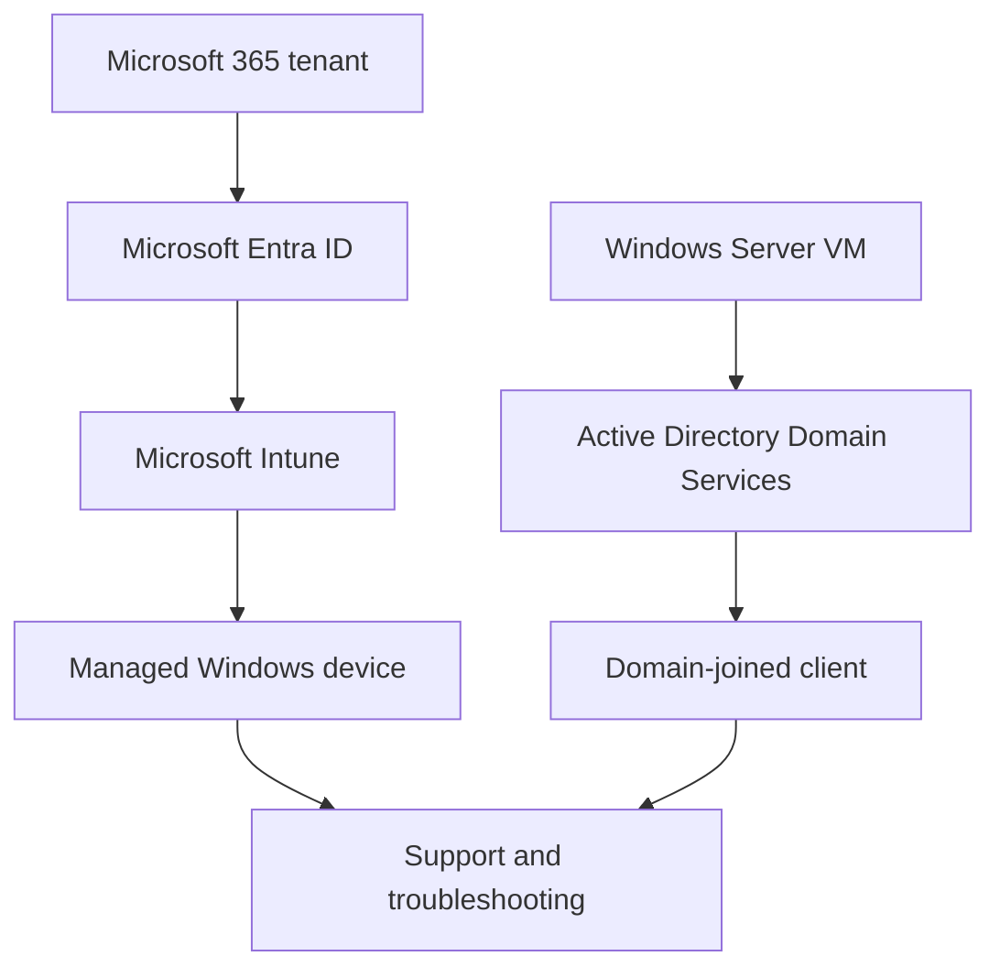

# Microsoft Administration Foundation Labs

## Microsoft 365, Intune, Autopilot, Active Directory and IT Support

A collection of personal Microsoft lab projects covering the core administration skills that support my later endpoint, identity and security projects.

> **Lab environment:** These projects were completed independently in personal Microsoft and VMware lab environments. All identities, devices, domains and configuration details are lab data.

## Lab Portfolio

| Lab | Focus | Technologies |
|---|---|---|
| 1 | Microsoft 365 tenant, users, licensing and MFA | Microsoft 365, Entra ID, Authenticator |
| 2 | Device enrolment and compliance | Microsoft Intune, Entra ID, Windows |
| 3A | Cloud device provisioning | Windows Autopilot, Intune, Windows Hello |
| 3B | On-premises directory services | Windows Server, AD DS, DNS, Group Policy |
| 4 | User lifecycle and group-based access | Active Directory, ADUC, GPO |
| 5 | Ticketing and Windows troubleshooting | Freshservice, Jira, Event Viewer |
| 6 | Networking and remote support | TCP/IP tools, RDP, TeamViewer |

## Environment Overview

---

## Lab 1: Microsoft 365 Tenant, Identity and MFA

### Scenario

Establish a Microsoft 365 tenant with licensed users, stronger authentication and least-privilege administration.

### What I Implemented

- Created and configured a Microsoft 365 tenant
- Created test users and assigned Microsoft 365 licences
- Registered Microsoft Authenticator and configured MFA
- Used a Helpdesk Administrator role instead of providing unnecessary Global Administrator access
- Tested user sign-in and administrative access

### Outcome

Established the identity and licensing foundation for the later Intune and Conditional Access labs.

[View the full technical documentation (PDF)](https://github.com/guyleonchen/Microsoft-Administration-Foundation-Labs/blob/main/Lab-01-Microsoft-365-Identity-and-MFA.pdf)

---

## Lab 2: Intune Device Enrolment and Compliance

### Scenario

Enrol a Windows virtual machine into cloud management and validate centrally assigned device controls.

### What I Implemented

- Joined a VMware Windows device to Microsoft Entra ID
- Enrolled the device into Microsoft Intune
- Applied password and compliance requirements
- Maintained a separate local administrator account to support least privilege
- Reviewed enrolment, policy and compliance status

### Outcome

Validated that the Windows device could be enrolled, managed and assessed through Intune.

[View the full technical documentation (PDF)](https://github.com/guyleonchen/Microsoft-Administration-Foundation-Labs/blob/main/Lab-02-Intune-Enrollment-and-Compliance.pdf)

---

## Lab 3A: Windows Autopilot Deployment

### Scenario

Provision a new Windows device through a controlled out-of-box experience with identity and security settings applied during setup.

### What I Implemented

- Registered a device for Windows Autopilot
- Created and assigned an Autopilot deployment profile
- Configured the Windows out-of-box experience
- Required MFA and configured Windows Hello for Business
- Provisioned the primary user as a standard user
- Validated the assigned deployment experience

### Outcome

Demonstrated cloud-driven Windows provisioning with secure authentication and least-privilege user configuration.

[View the full technical documentation (PDF)](https://github.com/guyleonchen/Microsoft-Administration-Foundation-Labs/blob/main/Lab-03A-Windows-Autopilot-and-Cloud-Management.pdf)

---

## Lab 3B: Active Directory Domain Services

### Scenario

Build a traditional on-premises Windows domain for centralised identity, computer and policy management.

### What I Implemented

- Deployed a Windows Server virtual machine
- Installed Active Directory Domain Services
- Created the `lab.local` forest and domain
- Configured DNS for domain operations
- Used Active Directory Users and Computers to manage objects
- Joined a Windows client to the domain
- Applied Group Policy settings

### Outcome

Created and validated a functioning Active Directory domain environment in VMware.

[View the full technical documentation (PDF)](https://github.com/guyleonchen/Microsoft-Administration-Foundation-Labs/blob/main/Lab-03B-Active-Directory-Domain-Services.pdf)

---

## Lab 4: Active Directory User Lifecycle and Group-Based Access

### Scenario

Manage common identity-support tasks and apply access according to group membership.

### What I Implemented

- Created and organised test users and security groups
- Reset passwords and tested user logins
- Added and removed users from access groups
- Applied password-complexity settings through Group Policy
- Verified effective group membership
- Demonstrated group-based role and resource access

### Outcome

Validated core Active Directory user-lifecycle and access-management tasks used in support and junior administration roles.

[View the full technical documentation (PDF)](https://github.com/guyleonchen/Microsoft-Administration-Foundation-Labs/blob/main/Lab-04-Active-Directory-User-Lifecycle.pdf)

---

## Lab 5: Ticketing and Windows Troubleshooting

### Scenario

Work through a structured incident lifecycle from user report to investigation, documentation and closure.

### What I Implemented

- Created and managed test tickets in Freshservice and Jira
- Recorded issue details, troubleshooting actions and resolutions
- Used Windows Event Viewer to investigate simulated operating-system issues
- Created knowledge-base documentation for repeatable fixes
- Closed tickets with documented outcomes

### Outcome

Demonstrated a traceable support workflow combining technical troubleshooting with clear service documentation.

[View the full technical documentation (PDF)](https://github.com/guyleonchen/Microsoft-Administration-Foundation-Labs/blob/main/Lab-05-Ticketing-and-Windows-Troubleshooting.pdf)

---

## Lab 6: Networking and Remote Support

### Scenario

Diagnose common connectivity issues and support a remote Windows endpoint.

### What I Implemented

- Used `ipconfig`, `ping` and `tracert` to inspect and test connectivity
- Simulated and investigated a VPN connectivity problem
- Used Remote Desktop Protocol for Windows remote access
- Used TeamViewer for remote-support testing
- Recorded troubleshooting steps and results

### Outcome

Demonstrated foundational network diagnosis and remote-support techniques within a controlled lab.

[View the full technical documentation (PDF)](https://github.com/guyleonchen/Microsoft-Administration-Foundation-Labs/blob/main/Lab-06-Networking-and-Remote-Support.pdf)

---

## Skills Demonstrated

- Microsoft 365 and Microsoft Entra ID
- Microsoft Intune and Windows Autopilot
- Active Directory Domain Services
- DNS and Group Policy
- User, group and licence administration
- Windows troubleshooting and Event Viewer
- Ticket documentation and knowledge management
- TCP/IP troubleshooting and remote support

[Return to Guy Cheneval's GitHub profile](https://github.com/guyleonchen)
